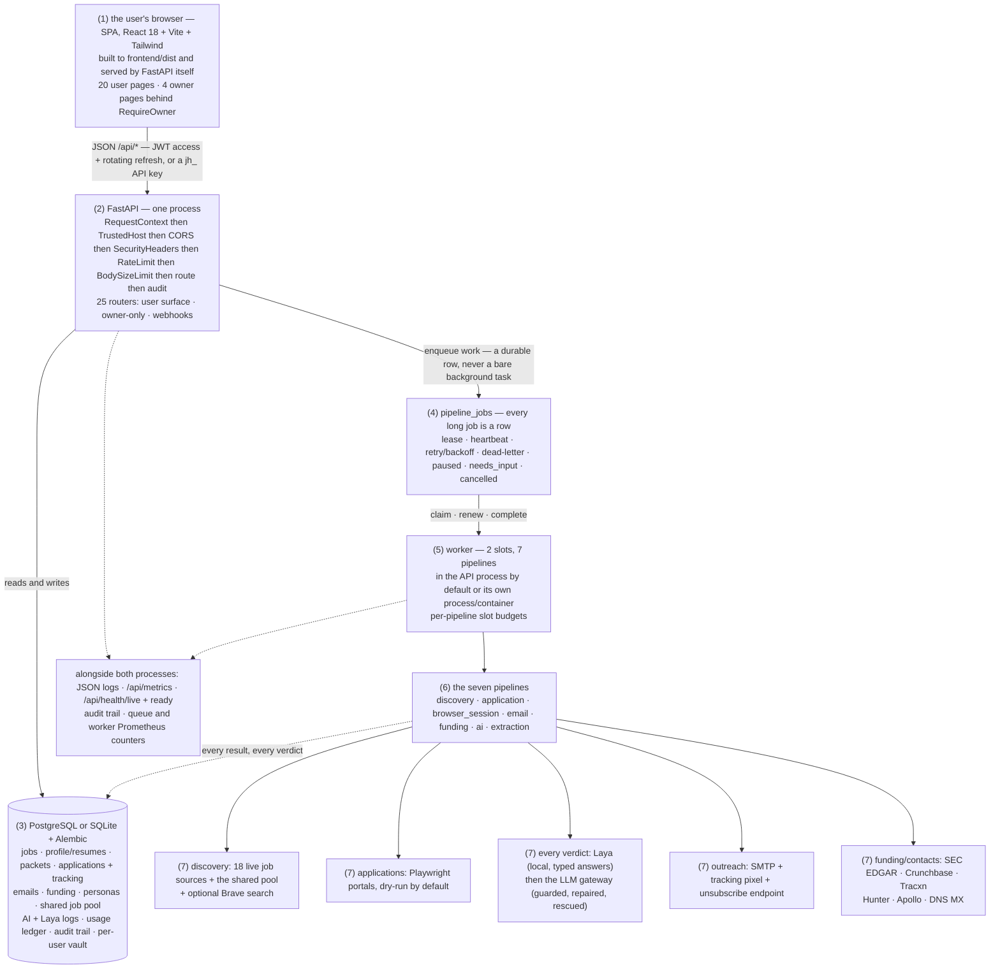
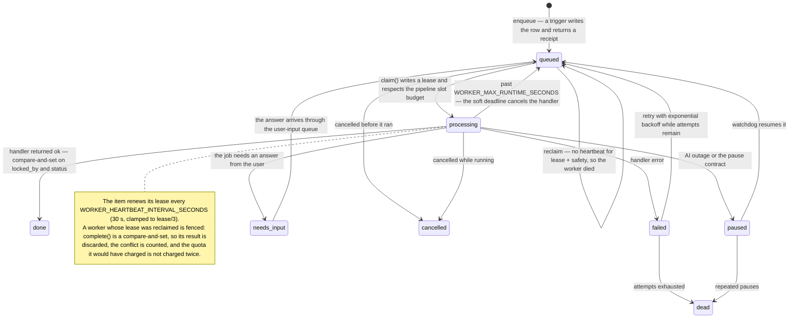
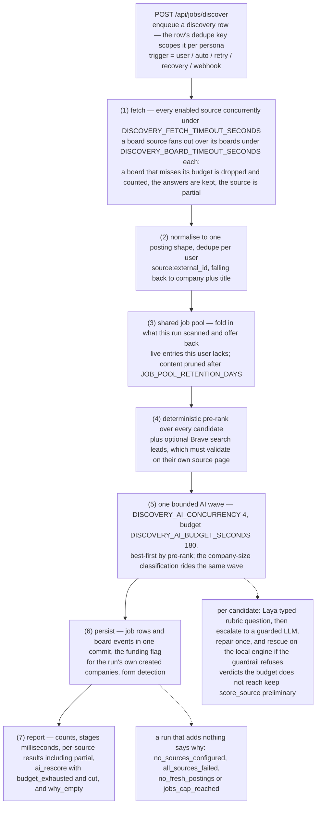
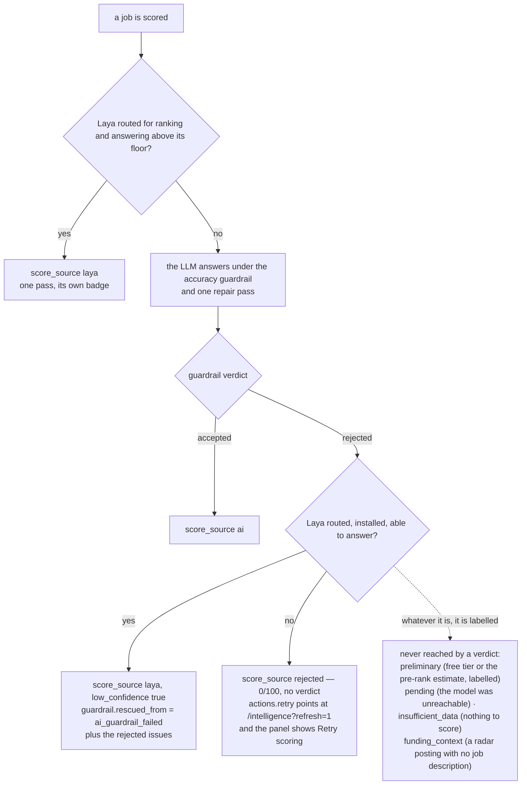

# JobHunter AI

**Current build: v2.5** — the changelog's `[Unreleased]` line (v2.3 shared job pool + owner-only AI
log, v2.4 discovery latency + worker leases, v2.5 scoring rescue + retry). The app reports
`APP_VERSION=2.3.0` on `/api/health`, `/api/meta` and `/api/metrics` and the SPA footer says v2.3;
both move when that line is cut as a release, so this README describes the system as it is built
here and says where each piece came from.

**A self-hosted, multi-user job-search platform**: it discovers real job postings, scores them
against your profile, keeps your portal credentials in an encrypted vault, prepares (and, when you
explicitly allow it, performs) applications, and runs compliant cold outreach — with an audit trail
for everything it does on your behalf.

Built with FastAPI + SQLAlchemy 2 + Alembic on the backend and React 18 + Vite + Tailwind on the
frontend. PostgreSQL is the production database; SQLite is supported for a single-user install.

---

## The system, end to end

The flow in one sentence: the browser only ever talks to the API, the API never does long work
inside a request, the worker is the only part that touches the outside world, and everything it
learns comes back as a database row the API can serve. The four diagrams below are Mermaid, so
GitHub renders them inline (VS Code and <https://mermaid.live> do too).

### 1. The map — browser → API → durable queue → worker → the outside world



### 2. The durable queue — how every long job travels

Nothing long runs inside an HTTP request: a trigger writes a `pipeline_jobs` row and returns a
receipt, and the row is the state (that is what makes "Queued → Preparing → Applied" survive
navigation and F5).



The lease, honestly:

* `claim()` writes `lease_expires_at` and respects each pipeline's slot budget (only *live* leases
  count against it), so one discovery run cannot take every worker slot.
* The running item renews the lease every `WORKER_HEARTBEAT_INTERVAL_SECONDS` (30 s, clamped to
  lease/3). That is what stops the reaper cloning a run that legitimately takes longer than
  `WORKER_LEASE_SECONDS` — and `complete()` is a compare-and-set on `locked_by` + `status`, so a
  worker whose lease *was* reclaimed is fenced: its result is discarded, the conflict is counted
  (`jobhunter_queue_complete_conflicts_total`), and the quota it would have charged is not charged
  twice.
* A handler that overruns `WORKER_MAX_RUNTIME_SECONDS` (a real soft deadline) is cancelled with an
  honest error instead of being killed by a reclaimer, and the reaper's own budget
  (`WORKER_REAPER_SAFETY_SECONDS`) is deliberately wider than a heartbeat interval.

### 3. A discovery run, stage by stage



### 4. Where a score's provenance comes from

Every number the product shows carries where it came from, and a verdict that could not be produced
says so instead of showing a `0`.



---

## 1. What the current build adds over the v1.2 demo

The v1.2 build was a working single-user prototype. v2.0 closed the gaps that block real use:

| Area | v1.2 | v2.0 |
|---|---|---|
| Accounts | single implicit user | **multi-user auth** — bootstrap owner, registration policy, JWT access + rotating refresh tokens, API keys, per-user row scoping on every table |
| Secrets | one process-wide Fernet key | **HKDF-derived per-user keys**, encrypted SMTP credentials, `SECRET_KEY`/`ENCRYPTION_KEY` validation, no hardcoded defaults in production |
| Data | `create_all`, SQLite only | **Alembic migrations**, PostgreSQL + SQLite, legacy v1.2 schema adoption, connection pooling, health/readiness probes |
| Pipelines | in-process `asyncio` tasks lost on restart | **durable queue** with leasing, retries/backoff, dead-letter, `python -m app.worker`, startup recovery of stalled items |
| Job sources | 2 keyless APIs + demo pool | **live adapters** behind one interface (today: Remotive, Arbeitnow, Jobicy, RemoteOK, Himalayas, The Muse, WeWorkRemotely, Adzuna, Jooble, USAJobs, Greenhouse, Lever, Ashby, Recruitee, Workable, SmartRecruiters, Personio, Workday) with robots.txt compliance, per-host politeness, caching and honest "unavailable" reporting for policy-gated sources |
| Forms | mocked detection | **real HTML form parsing** (labels, required flags, ATS fingerprints) + optional Playwright autofill that is dry-run by default |
| Resume | approve gate | **diff against the master, polished-version upload, fact guard, per-JD reuse decisions** |
| Email | send or not | **compliance gate** (consent, suppression list, daily limit, postal address, unsubscribe URL), dry-run default, open pixel, unsubscribe endpoint, webhook ingestion |
| Funding | AI-synthesised | **SEC EDGAR Form D** (real), optional Crunchbase/Tracxn/imported feeds, synthetic data only when explicitly opted into and labelled |
| Contacts | AI guess | **Hunter/Apollo + DNS MX verification**, heuristic fallbacks always marked `verified=false` |
| Ops | none | structured JSON logs, Prometheus metrics, `/api/health/{live,ready}`, audit trail, usage counters, backup script, CI, hardened container |

### What landed after v2.0

| Release | What it added |
|---|---|
| **v2.1** | AI as a hard dependency with an honest pause/resume contract (a real verdict or the precise reason there is none — never a guessed value presented as AI); per-user prompt/output token budgets; entitlements + quotas enforced everywhere; subscription billing (Stripe/Razorpay, plans, webhooks); consent/disclosure records; GDPR export + erasure; request-edge hardening |
| **v2.2** | Auto mode (a scheduler that queues work on a cadence and writes down every decision, including decisions *not* to run); every AI trigger enqueued and tracked — the live status chip is the queue row itself; one source interface with normalized postings, identity, throttling, retry and freshness (a closed posting does not look fresh); resumable onboarding (resume extraction runs on the queue); multi-stage matching with an explained, versioned verdict; personas, application packets, interview prep, analytics, notifications; outcome reports + the application tracking timeline |
| **v2.3** | The shared job pool (cross-user coverage, 7-day content retention, aggregates-only churn) and instant match the moment onboarding completes; the owner-only AI log (the exact request body per attempt, the answer, failures with reason/status) and the Laya decision log, rendered on **Admin → AI log**; bounded-parallel AI slices with schema-derived output budgets; the local decision engine (Laya) with owner routing, parking and low-confidence escalation; typed answer fields (checkbox / radio / select / date) across both apply surfaces |
| **v2.4** | Discovery latency measured and bounded: per-stage timings, one bounded-parallel AI wave with a per-run AI budget (verdicts best-first, the rest honestly `preliminary`), non-destructive board fan-out (`partial` instead of a discarded `timeout`), bounded-parallel search discovery, per-pipeline worker slot budgets; worker reliability: lease heartbeats, compare-and-set completion that fences a reclaimed worker, and a real soft deadline per item |
| **v2.5** | A guardrail-rejected score is retried automatically on the local engine (marked `low_confidence`, carrying the rejection) instead of dead-ending; the announced `actions.retry` plus a **Retry scoring** button that actually re-runs (`?refresh=1`); `score_source` beside the score on the board, so an unscored row never renders as `0 score`; a `laya` verdict clears the automation confidence floor like any engine verdict; rapid job switching fixed (click-token selection, aborted stale reads, one paid breakdown read per burst) |

---

## 2. Quick start

### Local development

```bash
# backend
python -m venv .venv && source .venv/bin/activate
pip install -r backend/requirements-dev.txt -r backend/requirements-autofill.txt
python -m playwright install --with-deps chromium
cp .env.example .env                     # fill SECRET_KEY + ENCRYPTION_KEY (see below)
cd backend && PYTHONPATH=. uvicorn app.main:app --reload --port 8000

# frontend (second terminal)
cd frontend && npm install && npm run dev   # http://localhost:5173, proxies /api to :8000
```

`./run.sh` also installs Python Playwright and Chromium by default. Use
`WITH_AUTOFILL=0 ./run.sh` for a browser-free install, `WITH_LAYA=0 ./run.sh` to omit the
optional local decision engine (Laya) — which is also warmed with a one-off model download
(`LAYA_WARMUP=0 ./run.sh` keeps Laya but skips the download) — or `AUTO_INSTALL=0 ./run.sh`
to skip all installation.
The frontend npm package is not a substitute for the backend Python package. Installing the
browser does not enable automatic submission; see the Assisted Apply settings below.

Generate the two secrets once:

```bash
python -c "import secrets; print('SECRET_KEY=' + secrets.token_hex(32)); print('ENCRYPTION_KEY=' + secrets.token_hex(32))"
```

Open http://localhost:5173 — the first screen is the **owner bootstrap** form. The first account
created becomes the owner; later accounts need `ALLOW_REGISTRATION=true` (default: closed).

### Accounts & test logins

Three supported ways in — pick whichever fits:

| Goal | How |
|---|---|
| First account (owner) | Open the app and fill in the bootstrap form, or `POST /api/auth/bootstrap` |
| Extra testers, scripted/CI | `python backend/scripts/create_user.py --email tester@example.com --password 'a-long-passphrase'` |
| Self-service sign-up | Set `ALLOW_REGISTRATION=true` in `.env` (then the SPA shows the register link) |

```bash
# create / reset / promote / list — see --help for everything
python backend/scripts/create_user.py --email you@example.com --password 'correct horse battery' --role owner
python backend/scripts/create_user.py --email you@example.com --password 'new-passphrase-123' --reset   # also revokes sessions
python backend/scripts/create_user.py --email you@example.com --password-file ./pw.txt                  # keep it out of shell history
python backend/scripts/create_user.py --email you@example.com --random-password                          # prints it once
python backend/scripts/create_user.py --list                                                             # who exists?
```

Passwords are checked against the configured policy (`PASSWORD_MIN_LENGTH`, default 10). The first
account created on an empty database is always the owner, whether it comes from the API or the CLI.
Local runs use SQLite at `backend/jobhunter.db` (relative paths are pinned next to the backend
package, so the API, the worker and the CLI all open the *same* database regardless of your shell's
working directory).

Production-shaped stack (PostgreSQL + API + worker):

```bash
cp .env.example .env      # ENVIRONMENT=production, set POSTGRES_PASSWORD, secrets, domain
docker compose -f docker-compose.prod.yml up -d --build
docker compose -f docker-compose.prod.yml run --rm backup   # on-demand backup
```

Full checklist: [`docs/DEPLOYMENT.md`](docs/DEPLOYMENT.md).

---

## 3. Feature tour

**Discovery** — keyword context is mined from your resume + preferences (optionally by AI), then
each enabled source is queried concurrently. Every posting is normalised to one shape, deduplicated
(`source:external_id`, falling back to `company:title`), scored — a deterministic pre-rank for
every candidate, plus up to `AI_RESCORE_TOP` (12) guardrailed verdicts on Pro, assigned best-first
inside the run's AI budget (a free-tier run makes no AI calls and stays on the labelled estimate;
every row carries its `score_source` and the run reports `ai_rescore`) — classified by company size
and persisted with its source, salary and remote flags.
Sources that need a key report *why* they are unavailable instead of silently returning nothing.
A run that adds nothing to the board reports *why* it was empty — `no_sources_configured` (nothing
was attempted), `all_sources_failed` (an outage, with the per-source errors), `no_fresh_postings`
(healthy sources, nothing inside the freshness window) or `jobs_cap_reached` (the plan's board cap)
— plus a `summary` of the counts behind that verdict; `GET /api/jobs/discovery/last-run` serves it and the Jobs page renders it, so an empty board
is never a reason-less "no fresh jobs".

The run is **measured, not guessed**: every stage reports its own milliseconds
(`report["stages"]` — fetch, pool, pre-rank, scoring, classification, persistence, form detection),
the AI work rides one bounded-parallel wave under a per-run budget, and a source whose boards were
slow comes back `partial` with the boards that answered rather than vanishing. See [§ the discovery
run](#3-a-discovery-run-stage-by-stage) for the exact order.

Every run also feeds the **shared job pool** and reads from it: the postings it scanned are folded into
one cross-user corpus (same canonical identity as the board, so a pool row merges with a live row rather
than duplicating it), and the pool offers back live entries this user does not have yet — coverage the
run's own adapters could not produce, at zero fetch cost. Retention is hard: nothing older than
`JOB_POOL_RETENTION_DAYS` (7 by default) survives, and pruning deletes the posting's *content* —
title, description, URL, payload — leaving only an aggregate row (counters, a SHA-256 identity, the
public company name as the churn dimension) in `job_pool_metrics`. The same route is taken the moment a
posting is reported withdrawn, so "deleted jobs keep aggregated metrics only" is the retention rule, not
a second code path. Those aggregates are owner-only: they ride on `GET /api/admin/overview`
(`job_pool`, rendered as **Admin → Shared job pool**) and nothing on the user surface exposes them.
`JOB_POOL_ENABLED=false` restores the pre-pool behaviour exactly — no reads, no writes, no matching.

Finishing onboarding starts matching immediately: the moment the resume extraction lands (or a review
decision activates the profile), the pool's best current matches are written to the board with
deterministic `preliminary` scores — no network, no provider calls, honestly labelled — and the user's
own live discovery run is queued behind them. The hook is idempotent per (profile, document) and never
fails the onboarding step.

**Everything long is a queue row.** Discovery, application preparation, assisted browser sessions,
outreach, funding scans, resume extraction and the AI tasks are `pipeline_jobs` rows, enqueued with a
receipt and executed by a worker — in the API process by default (`RUN_WORKER_IN_API=true`) or in its
own process/container (`python -m app.worker`, which is what `docker-compose.prod.yml` runs). The row
*is* the state: the header chip and the under-button status lines poll it, so "Queued → Preparing →
Applied" survives navigation and a page reload. The queue is leased, not fire-and-forget: the item
renews its lease while it runs, completion is a compare-and-set that fences a worker whose lease was
reclaimed, a handler that overruns the soft deadline is cancelled with an honest error, an AI outage
*pauses* the item (and the watchdog resumes it when the provider is back) instead of dead-lettering
innocent work, and per-pipeline slot budgets (`WORKER_PIPELINE_LIMITS`) stop one slow discovery run
from taking every worker slot.

**Applications** — a job's apply flow detects the portal (Greenhouse/Lever/Workday/custom), detects
required fields from the real HTML, maps them from your profile, and either:
* reuses a previously approved tailored resume (JD similarity ≥ 0.85),
* generates a new one that must be approved (fact guard: never invents employers, titles or dates),
* creates/reuses a vault credential for the portal,
* asks **you** for anything it cannot determine (the User-Input queue), then re-queues itself.

Submitting through a browser requires the optional Playwright extra and *two* explicit opt-ins
(`AUTOFILL_ENABLED`, `AUTOFILL_ALLOW_SUBMIT`, plus the automation consent). Without them the run is
dry-run: fields are mapped and a screenshot is stored, but nothing is submitted.

**Outreach** — draft → disclosure → compliance check → send. `POST /api/emails/{id}/send` requires the
`outreach` disclosure (403 `consent_required`, and the SPA offers to record it and retry); the
compliance gate then blocks on missing terms, suppressed recipients, invalid addresses, daily
limits, missing SMTP, missing postal address and missing unsubscribe URL. Both layers are enforced
in code — the second one is what protects worker/queued sends that never touch the route. Real sends are off by default (`EMAIL_SENDING_ENABLED=false`,
`EMAIL_DRY_RUN=true`). Opens are tracked with a 1×1 pixel and unsubscribes are honoured immediately
via a one-click endpoint and the suppression list.

**Scoring, and what happens when the model's answer is unusable** — every job carries the number
*and* where it came from (`score_source`: `laya`, `ai`, `preliminary`, `pending`, `rejected`,
`insufficient_data`, `funding_context`), and the board renders a row without a verdict as its
provenance rather than as `0 score`. When the accuracy guardrail refuses the model's answer (the
answer and its one repair pass), the local decision engine is asked once before the pair is written
off — under the owner's own routing policy — and a rescued verdict is labelled `laya` with
`low_confidence` and the rejection that produced it. If there is still no verdict, the read announces
`actions.retry` and the panel offers **Retry scoring** (`?refresh=1`, which is the only path that
re-runs scoring; a plain re-read serves the stored verdict for free).

**Funding radar** — real Form D filings from SEC EDGAR (no key needed, descriptive User-Agent
required) plus optional Crunchbase/Tracxn/operator-imported feeds. Companies with open roles go to
the application flow; the rest can be cold-emailed. Synthetic demo companies exist but are opt-in
and labelled `DEMO DATA`.

**Vault** — credentials are encrypted with a key derived per user (`HKDF(master, "user:{id}:vault")`)
and rotated on read from the legacy global key. Reveals, exports and deletions are audited; exports
are available in Chrome and Apple Passwords CSV formats.

---

## 4. API surface (highlights)

| Area | Endpoints |
|---|---|
| Auth | `GET /api/auth/status`, `POST /api/auth/{bootstrap,register,login,refresh,logout}`, `GET /api/auth/me`, `POST /api/auth/password`, `GET/POST/DELETE /api/auth/api-keys` |
| Onboarding | `POST /api/onboarding/session`, `GET /api/onboarding/status`, `GET /api/onboarding/sessions/{id}`, `POST /api/onboarding/resume` (non-blocking upload → background extraction), `POST /api/onboarding/retry` |
| Account | `GET /api/account/{disclosures,consent,audit,export,runtime,billing-usage}`, `POST /api/account/consent`, `DELETE /api/account?confirm=<email>` |
| Resumes | `POST /api/resume/upload`, `GET /api/profile/current`, `POST /api/resumes/generate`, `POST /api/resumes/{id}/{approve,reject}`, `GET /api/resumes/{id}/{preview,diff,download}`, `POST /api/resumes/{id}/polish`, `PUT /api/resumes/{id}/tags` |
| Jobs | `POST /api/jobs/discover`, `GET /api/jobs/discovery/last-run`, `GET /api/jobs` (each row carries its `score_source`), `GET /api/jobs/{id}`, `GET /api/jobs/{id}/intelligence` (the stored verdict, or `?refresh=1` to re-score — the route `actions.retry` points at), `POST /api/jobs/{id}/{apply,input,mark-applied,retry,skip}`, `GET /api/user-input-queue`, `POST /api/classify/company`, `GET /api/pipelines/{stats,jobs}` |
| Matches | `POST/GET /api/jobs/{id}/match` (the multi-stage, explained, versioned verdict), `GET /api/matches`, `POST /api/jobs/{id}/match/feedback`, `GET /api/matches/calibration` |
| Vault | `GET/POST/DELETE /api/vault`, `GET /api/vault/{id}/reveal`, `GET /api/vault/export/{chrome,apple}` (+ signed `{chrome,apple}/url` for browser downloads) |
| Email | `POST /api/emails/generate`, `GET /api/emails`, `POST /api/emails/{id}/{approve,send,check}`, `GET /api/emails/{id}/events`, `GET/POST/DELETE /api/emails/suppressions` |
| Funding | `GET /api/funding/{companies,providers,context}`, `POST /api/funding/refresh`, `POST /api/funding/{name}/process` |
| Me (user surface) | `GET /api/me/dashboard` — the tenant-scoped aggregate the home page renders (profile completeness, discovery status, top matches with reasons, review/attention queues, applications in progress, interview activity, weekly outcome report, follow-up reminders) — and `GET /api/me/assistant`, the sanitized assistant-availability signal (no provider URL, key, model or usage on it) |
| Settings | `GET/PUT /api/settings` (the `ai` category is owner-only: members get `{"configured": bool}` and cannot write it), `GET /api/settings/ai/status` *(owner)*, `GET /api/settings/runtime` *(owner)*, `GET/POST/DELETE /api/ai/config` *(owner)* |
| Admin (owner only) | `GET /api/admin/overview` (sources, queues, usage & cost, failure rates, automation health, shared job pool, AI-log and Laya rollups), `GET /api/admin/audit`, `GET/PUT /api/admin/flags`, `GET /api/admin/users`, `PUT /api/admin/users/{id}/{plan,role}` — every route 403s non-owners with `owner_required` |
| Admin — AI log (owner only) | `GET /api/admin/ai/calls` (list, filter by workflow/status/user), `GET /api/admin/ai/calls/{id}` (**the exact request body per attempt** + answer excerpt), `GET /api/admin/ai/stats`, `GET /api/admin/laya/decisions`, `GET /api/admin/laya/stats` — rendered at **Admin → AI log** (`/admin/ai`); nothing here is reachable from a user surface |
| Ops | `GET /api/health`, `/api/health/live`, `/api/health/ready`, `/api/metrics`, `/api/meta`, `/api/logs`, `/api/dashboard/summary`, `GET /api/ops/status` *(owner)*, `GET/POST /api/ops/queue/*` *(owner)* |
| Tracking | `GET /api/track/open/{token}.png`, `GET/POST /api/track/unsubscribe/{token}`, `POST /api/track/events` |

Interactive docs: `/api/docs`. Machine-readable spec: `/api/openapi.json`.

---

## 5. Configuration

Everything is environment-driven; see [`.env.example`](.env.example) for the annotated list. The
owner-only AI log is `AI_LOG_ENABLED` (on by default; `false` restores the previous behaviour
exactly), pruned to `AI_LOG_RETENTION_DAYS` (7) with bodies clipped to `AI_LOG_PROMPT_CHARS`
(20000) and answers to `AI_LOG_RESPONSE_CHARS` (2000) — diagnostics, not accounting: the AI credit
ledger remains the permanent record. The
values you must set in production are `SECRET_KEY`, `ENCRYPTION_KEY`, `DATABASE_URL`,
`CORS_ORIGINS`, `ALLOWED_HOSTS` and (for real outreach) the `EMAIL_*` block. The config validator
refuses to boot in `ENVIRONMENT=production` with placeholder secrets, wildcard CORS or SQLite
unless you explicitly override with `ALLOW_SQLITE_IN_PROD=true`.

Per-user settings (AI keys, SMTP, sources, thresholds) live in the app under **Settings** and are
stored encrypted where they are secret.

Discovery is bounded by knobs an operator can tune without a code change:
`MAX_CONCURRENT_FETCHES` (fan-out width), `DISCOVERY_FETCH_TIMEOUT_SECONDS` (per-source budget
inside one run), `DISCOVERY_BOARD_TIMEOUT_SECONDS` (per *board* inside a board source — a slower
board is dropped and counted while the boards that answered are kept, so the source reports
`partial` instead of `timeout` with nothing), `DISCOVERY_AI_CONCURRENCY` (verdicts in flight;
the AI gateway's `AI_MAX_CONCURRENCY` stays the hard bound) and `DISCOVERY_AI_BUDGET_SECONDS`
(the wall-clock budget for one run's AI work — verdicts are assigned best-first and the ones the
budget does not reach keep their labelled `preliminary` estimate). The board's own storage cap is
the plan's `jobs_max` entitlement (enforced at discovery, so a full board says so instead of
silently dropping postings) and `MAX_ATS_BOARDS_PER_RUN` bounds how many boards one board source
fans out over. `JOB_POOL_*` sizes the shared pool: retention, prune batch, ingest cap, how many
pool candidates a run is offered, and how many jobs the onboarding instant match may add.

The worker is bounded the same way: `WORKER_CONCURRENCY` (slots), `WORKER_LEASE_SECONDS` +
`WORKER_HEARTBEAT_INTERVAL_SECONDS` (how long a claim is held, and how often the item proves it is
alive — the heartbeat is clamped to lease/3 so two missed beats cannot lose a row),
`WORKER_MAX_RUNTIME_SECONDS` (a real soft deadline per item; `0` disables it), `WORKER_MAX_ATTEMPTS`
and `WORKER_MAX_RECLAIMS` (failure and reclaim budgets, both ending in the same `dead` state),
`WORKER_REAPER_INTERVAL_SECONDS` + `WORKER_REAPER_SAFETY_SECONDS` (how a crashed worker's lease is
recovered — deliberately wider than a heartbeat) and `WORKER_PIPELINE_LIMITS` (per-pipeline slot
budgets, `discovery=1` by default, counted over live leases only).

### Local decision engine (Laya)

Ranking, company-size classification and form-field mapping are *typed decisions* (a rubric
score, a choice among declared options), not writing tasks. They can be answered by **Laya** —
a self-hosted, Apache-2.0 decision model (`pip install -r backend/requirements-laya.txt`, or
`WITH_LAYA=1 ./run.sh`) that returns calibrated typed answers in one forward pass and is
structurally unable to return malformed JSON (the main cause of AI failures in ranking). Anything
that must *write* text (tailored resumes, emails, interview prep) always stays on the AI gateway.

`./run.sh` installs **and warms** Laya by default: `backend/scripts/warm_laya.py` pre-downloads
the `english` + `multilingual` checkpoints into the Hugging Face cache once (a marker skips it on
later starts), so decisions work offline and the first one is instant. `LAYA_WARMUP=0` skips the
download; `WITH_LAYA=0` omits the package. Docker images leave Laya out entirely — build with
`--build-arg WITH_LAYA=1` to bake it in (`LAYA_WARMUP=1`, the default there, also bakes the
weights for fully-offline containers; see `docs/DEPLOYMENT.md`).

Routing is owner-configured in **Admin → Local decision engine (Laya)**:

* **Auto** — Laya first; the AI gateway escalates low-confidence answers, and answers everything
  when Laya is not installed (the pre-Laya behaviour, byte for byte);
* **Laya only** — never fall back to the AI gateway for these decisions; an engine outage is
  reported honestly (the same "pending / unavailable" surfaces an AI outage gets);
* **AI only** — Laya is never consulted.

Per-task opt-ins (ranking / classification / field mapping) sit next to the mode, and
`LAYA_ENABLED=false` is the operator ceiling that turns all routing off. Verdicts answered by
Laya carry their own provenance (`score_source=laya`, its own badge in the UI) — never presented
as an AI verdict.

---

## 6. Testing & quality gates

```bash
# backend — hermetic: temp SQLite, no network, no AI key
cd backend && PYTHONPATH=. ../.venv/bin/python -m pytest tests/ -q     # 1455 tests

# lint
ruff check backend

# frontend — component tests (hermetic: the API client is mocked), then typecheck + build
cd frontend && npm test && npx tsc --noEmit && npm run build           # 209 tests, 27 files
```

CI (`.github/workflows/ci.yml`) runs the suite twice (SQLite **and** PostgreSQL 16), applies
Alembic migrations on a fresh database, typechecks and builds the frontend, builds the production
image and audits dependencies (pip-audit + npm audit).

Test coverage includes: auth/tenancy isolation, vault encryption + re-keying, queue leasing and
worker execution (`test_queue_and_worker.py`, plus `test_discovery_latency_and_leases.py` for the
lease heartbeat vs the reaper, compare-and-set fencing, the soft deadline, the stage-timing contract,
one bounded AI wave with its budget cut, partial board fan-out and the per-pipeline slot budgets),
the scoring provenance ladder including the guardrail rescue and the announced retry
(`test_scoring_guardrail_rescue.py`), discovery/source adapters, the shared job pool (retention/deletion aggregates,
the owner-only snapshot, instant match and its idempotency), the owner-only AI log (the body stored
is the body sent, failures with reason/status, the Laya status vocabulary, retention, clipping and
masking, member 403 on every route), form detection, autofill planning, resume generation
+ fact guard + diff/polish, outreach compliance gates, suppression/unsubscribe/open tracking,
funding providers (including the anti-fabrication guard), GDPR export/delete under **enforced** foreign keys
(the schema's FKs are checked, not disabled), metrics and health.

---

## 7. Honest limitations

* **LinkedIn, Indeed, Naukri and Instahyre are not scraped.** They prohibit it in their terms and
  block automation; the app reports them as gated rather than pretending. Workers/partners with a
  licence can add an adapter in `app/services/sources/adapters.py`.
* **Browser submission needs Playwright**, which is an optional extra
  (`backend/requirements-autofill.txt` + `playwright install chromium`). Automating an application
  may violate a portal's terms — the automation consent text says exactly that, and the default is
  dry-run.
* **Funding data is Form D-level.** SEC EDGAR gives you company + filing date + link, but Form D
  filings do not disclose round sizes. Paid providers are wired but need your licence key.
* **Contact data quality depends on your provider key.** Without Hunter/Apollo the app only
  proposes role mailboxes and marks them unverified; it never invents a personal address.
* **Email deliverability is your responsibility.** Configure SPF/DKIM/DMARC for the sending domain;
  the app supplies the unsubscribe header/footer, suppression list and rate limiting.
* **The automatic rescue of a rejected score needs the local engine.** When the accuracy guardrail
  refuses the model's answer, the retry happens on Laya — so it exists where Laya is installed and
  routed (Settings → decision engine: `auto` or `laya_only`, plus the ranking opt-in). Without it the
  verdict stays honestly `rejected` and the **Retry scoring** button is the path forward. This is a
  deliberate refusal to invent a score, not a missing feature.
* **The shared job pool shares public postings, not people.** Entries carry no tenant column; the
  per-user link (`job_pool_seen`) is a normal owned row that account erasure deletes, and the pool's
  owner-facing aggregates are counters. A deployment that must not share postings between tenants sets
  `JOB_POOL_ENABLED=false` and gets the pre-pool product.
* **The AI log is owner-only, bounded and scrubber-first.** It stores the request *bodies* we sent
  (never headers, so never the API key) after the gateway's secret scrubber, clipped and pruned on
  write; a member gets 403 on every `/api/admin/ai/*` route. It is a diagnostic aid for the operator,
  not an export surface — the credit ledger stays the accounting record.
* **Compliance sign-off is still a human step.** `docs/COMPLIANCE.md` documents the built-in
  controls and the questions your counsel should answer before you enable automation for real
  users.

---

## 8. Operations

```bash
# apply migrations / inspect state
cd backend && python -m alembic upgrade head && python -m alembic current

# run the pipeline worker separately from the API (the API runs one in-process by
# default: RUN_WORKER_IN_API=true; docker-compose.prod.yml sets false and runs this)
cd backend && PYTHONPATH=. python -m app.worker

# nightly backup (SQLite: online backup + integrity check; Postgres: pg_dump | gzip)
python backend/scripts/backup.py --out /backups --keep 14

# scrape metrics
curl -H "Authorization: Bearer $METRICS_TOKEN" http://localhost:8000/api/metrics
```

Health probes: `/api/health/live` (process up), `/api/health/ready` (database + migrations + queue).
Logs are JSON when `LOG_JSON=true`; every record carries `request_id` (a string token) and
`user_id` (a number) when known.

---

## 9. License & disclaimer

No license file is included in this repository; treat it as proprietary until you add one. The
software automates actions on third-party sites — you are responsible for complying with each
site's terms of service and with the anti-spam and privacy laws that apply where you and your
contacts are located.

### Search-engine job discovery

Optional, privacy-minimized Brave Web Search discovery supplements direct ATS
adapters. Results remain discovery leads until their source pages validate them;
search snippets are never job descriptions. Disabled by default. See
[Search discovery setup and operations](docs/SEARCH_DISCOVERY.md) for provider
selection, storage-rights requirements, shared quotas/caching, and separate
provider cost accounting.
